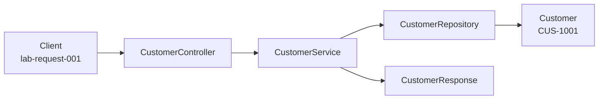

#### Layered Workflow

```mermaid
flowchart LR
    Client["Client<br/>lab-request-001"] --> CTRL["CustomerController"]
    CTRL --> SVC["CustomerService"]
    SVC --> REPO["CustomerRepository"]
    REPO --> ENT["Customer<br/>CUS-1001"]
    SVC --> DTO["CustomerResponse"]
```
- React, Kafka, and PostgreSQL are out of scope for Lab 8