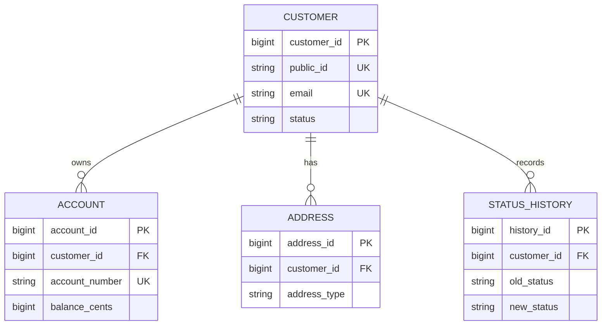

```bash
customer_id        — PostgreSQL identity surrogate PK
public_id          — immutable business id (CUS-1001)
email              — unique lookup (case-normalized in app or SQL)
account_number     — unique business account identifier
status_history     — append-only audit trail for status changes
```

