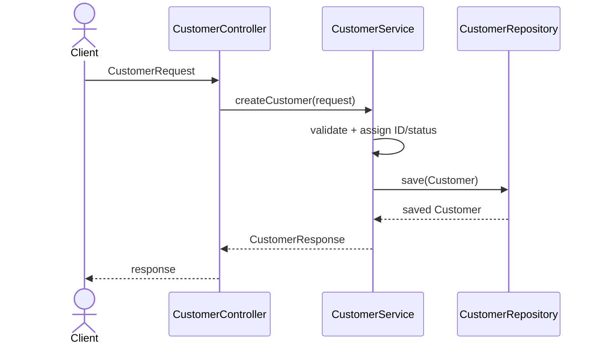
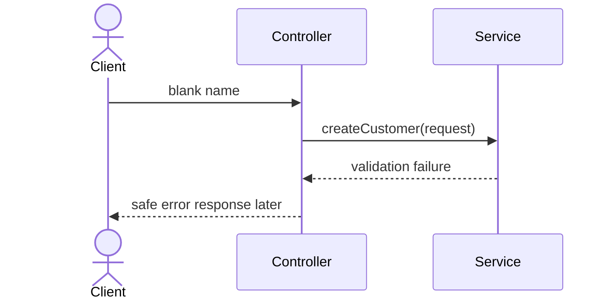

#### Step 1

#### Step 2
|Boundary|Input|Output|
|--------|-----|------|
|Client -> controller|Future transport payload|`CustomerRequest`|
|Service validation|Request DTO|valid domain values|
|Service -> repository|`Customer` entity|saved entity|
|Service -> controller|entity\result|`CustomerResponse`|
#### Step 3

#### Step 4
Now
- Package names and stub responsibilities
- Plain Java types that compile
- Documented flow
Later
- Spring controller annotations
- Validation annotations
- Repository implementation/JPA
- HTTP response mapping
- Correlation-ID logging