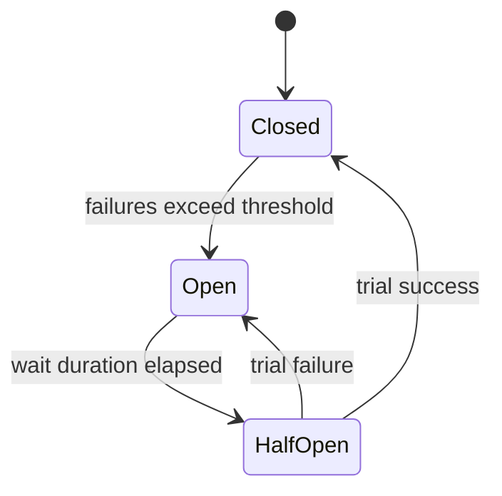

# Lab 32 — Circuit States

## Step 1 — Closed

Normal calls flow; failures counted.

## Step 2 — Open

Calls fail fast / use fallback; Account Profile is not hammered.

## Step 3 — Half-open

Trial calls probe recovery; success → closed, failure → open.

## Step 4 — Draw

## Scope
Pre-lab only — do not finish the full graded lab in this exercise.