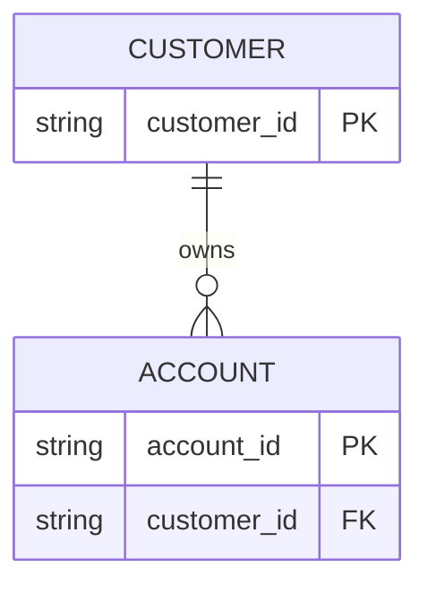

# Lab 37 — ER Sketch

## Reference

| Relationship         | Cardinality               |
|----------------------|---------------------------|
| customer → account   | 1:N                       |
| account.customer_id  | FK → customer.customer_id |
| customer.customer_id | PK / unique business key  |

## Step 2 — Diagram

## Step 3 — Cascade policy

DELETE behavior: RESTRICT because it does not make sense to delete a customer if they have accounts. UPDATE behavior:
CASCADE because if a customer_id changes, the change should propagate to accounts.

## Step 4 — Boundary

Do not create Kafka outbox tables in this module unless guide requires.

## Scope

Pre-lab only — do not finish the full graded lab in this exercise.