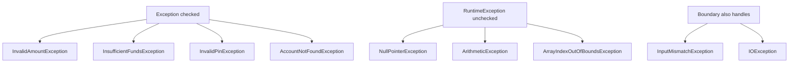

```mermaid
flowchart TB
  Ex["Exception checked"] --> IA["InvalidAmountException"]
  Ex --> IF["InsufficientFundsException"]
  Ex --> IP["InvalidPinException"]
  Ex --> AN["AccountNotFoundException"]
  RT["RuntimeException unchecked"] --> NPE["NullPointerException"]
  RT --> AE["ArithmeticException"]
  RT --> AIOOB["ArrayIndexOutOfBoundsException"]
  Bound["Boundary also handles"] --> IM["InputMismatchException"]
  Bound --> IO["IOException"]
```