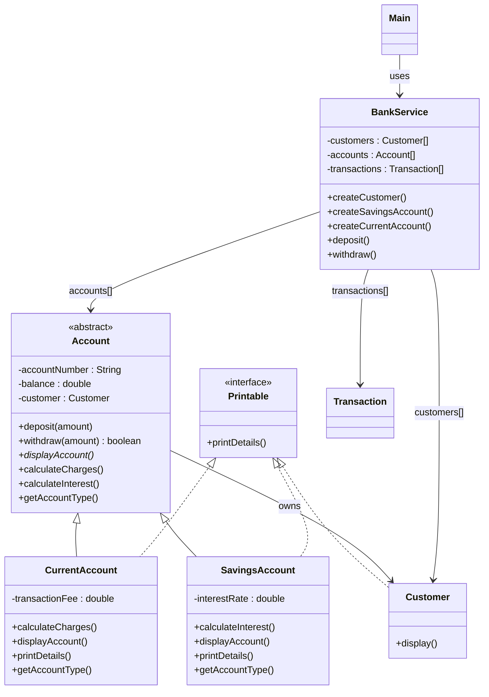

#### UML Diagram

#### SOLID and Inheritance+Polymorphism
- S.O.L.I.D.: Single Responsibility, Open/Closed, Liskov Substitution, Interface Segregation, Dependency Inversion.
    - SRP: Maintains code to only have one reason to change--because it has one job.
    - OCP: Keep old, tested, and verified code the same and only add new classes so it remains stable and modular.
    - LSP: Subclasses should work wherever their parent class is used so the program behaves consistently.
    - ISP: Small, focused interfaces keep classes from implementing methods they don't need.
    - DIP: Depending on abstractions instead of specific classes makes code more flexible, reusable, and easier to test.
- Inheritance is creating a new class from an existing class to use some of the class's capabilities to save code and add features safely. Polymorphism is like having a template/blueprint for something. Using that blueprint, you can create different things that behave similar to the blueprint. 

#### Commands
- Run
  - javac -d out src/com/academy/bank/*.java
  - java -cp out com.academy.bank.Main
- Cleanup
  - Remove-Item -Recurse -Force out