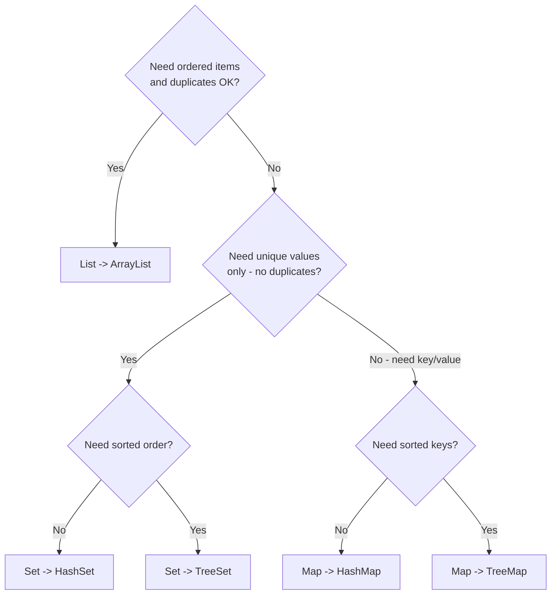

#### Commands (PowerShell)
- Compile and Run
```bash
cd "$HOME/java-bootcamp/examples/Lab5-LibraryManagement"
javac -d out src/com/academy/library/*.java
java -cp out com.academy.library.Main
```
- Clean Rebuild
```bash
cd "$HOME/java-bootcamp/examples/Lab5-LibraryManagement"
Remove-Item -Recurse -Force out
javac -d out src/com/academy/library/*.java
```
- Security and Cleanup
```bash
cd "$HOME\java-bootcamp\examples\Lab5-LibraryManagement"
Remove-Item out -Recurse -Force
```
#### Step 15 Results
- I used a for loop to add 1000 integers (0-1000) into each List type. ArrayList won most time while LinkedList was always slower.
#### Success Critera
0. Pass
1. Pass
2. Pass
3. Pass
4. Pass
5. Pass
6. Pass
#### Implementation Checkpoints
Checkpoint A:
1. Pass
2. Pass
3. Pass
Checkpoint B:
1. Pass
2. Pass
3. Pass
Checkpoint C:
1. Pass
2. Pass
3. Pass
4. Pass
Checkpoint D:
1. Pass
2. Pass
3. Pass
#### Manual Verification
1. Menu shows options; invalid `abc` → invalid message → menu returns.
   * Pass
2. Add book `101` / member `1` / borrow / reports match the sample themes above.
   * Pass
3. Duplicate book ID `101` → `Book already exists.   *
   * Pass
4. Display books shows at least one iteration style with your title.
   * Pass
5. Sort by title changes order when multiple books exist.
   * Pass
6. Category insights list `Programming` after the sample add.
   * Pass
7. Exit `11` → `Thank You` and process ends.
   * Pass
#### Map Field to List/Set/Map

#### Reflection Questions
1. When choose `List` over `Set`?
   * Choose list when you need order and duplicates are allowed. Choose set when you need unique elements with no duplicates. 
2. Why `HashSet` before inserting a book ID?
   * HashSets require no duplicates, so it does not allow books with the same book ID to be inserted. Additionally, order does not matter in this case. 
3. Why a `Map` for “currently borrowed” vs only a boolean?
   * A Map stores more information than just a boolean. It can store who borrowed the book as well.
4. `HashMap` vs `TreeMap` in this lab?
   * HashMaps are used when order is not taken into consideration and provides quick look up times. TreeMaps maintain key order which is useful for providing sorting features and making human-readable reports. 
5. `Comparable` vs `Comparator` for books?
   * Comparable sorts in natural order depending on the type while Comparator allows for different sorting criteria. 
6. Which iteration style would you use most in production—and why?
   * It would depend on the goal, but I would choose an enhanced for loop because it is simple and easy to read. 
7. CRM: which collection for customer list / unique emails / id→customer lookup?
   * Customer list: ArrayList<Customer>; it maintains order and allows duplicates (first name or last name)
   * Unique emails: HashSet<String>; guarantees that emails are unique
   * ID → Customer lookup: HashMap<String, Customer>; fast lookup by customer ID